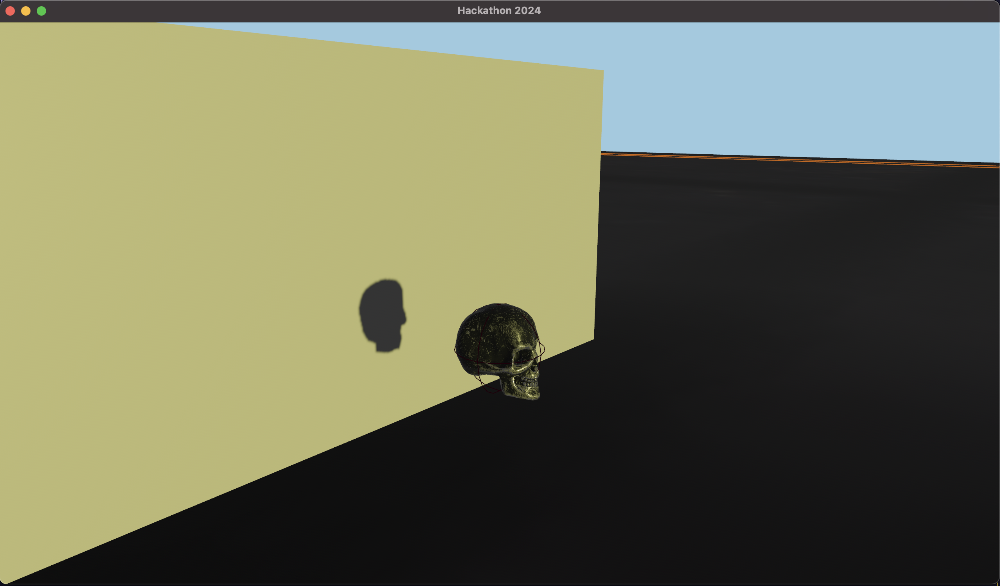
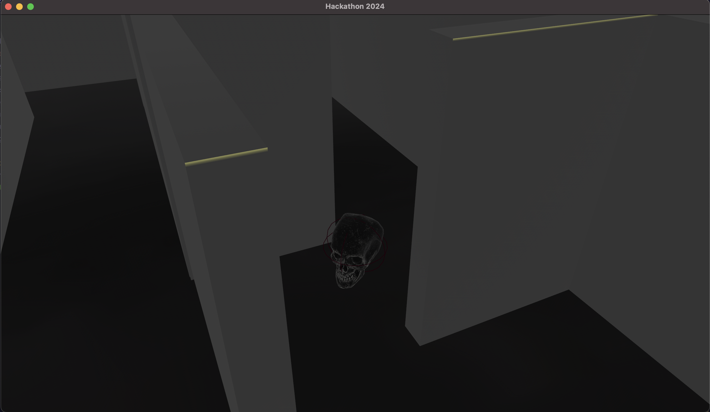

# Hackathon 2024 (my_game)

Entry for the UNR ACM Club Biggest Little Hackathon 2024. From Friday, April 12th at 18:00, until Sunday, April 14th at 9:00.

## My_Game

This is a maze game coded in the Rust programming language, using the game engine Bevy, and the physics engine Rapier3d.



## Features

- A maze designed in blender
- A third person camera
- Walking or sprinting
- A metallic skull to control (The Player)
- A titled window, "Hackathon 2024" (This took long enough, I'm calling it a feature)

## Controls

| Key   | Action        |
| ----- | ------------- |
| W     | Move forward  |
| A     | Move left     |
| S     | Move backward |
| D     | Move right    |
| Mouse | Move camera   |

_(Note the controls are relative to the camera direction)_



## Installation

In order to install and run this game, you will need to have Rust installed on your machine. You can install Rust by following the instructions on the [Rust Website](https://www.rust-lang.org/tools/install).

Then ensure you have the `cargo` command available and then run the following:

```
git clone https://github.com/Ap0ll02/Hackathon2024.git
cd Hackathon2024
cargo run
```

_The standalone executable is not currently ready, as assets need to be bundled into the executable file._

## Future Plans

- Add collision detection by implementing a new physics engine with mesh colliders
- Add a win condition
- Add a timer, or lose condition
- Menu screen

## Special Thanks

- Coffee, for keeping my sanity in check
- Friends, for making me go to bed and get good sleep every night

## Credits

[Third Person Camera Rust Crate](https://github.com/andrewcs149/bevy_third_person_camera)

[Skull Model (Metallic Skull)](https://skfb.ly/6UZ7G)
